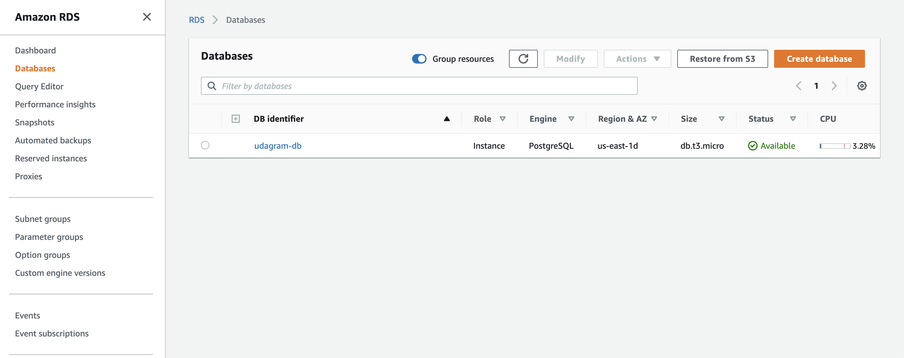
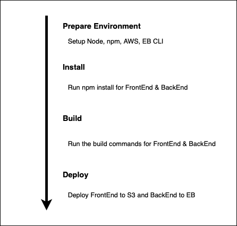
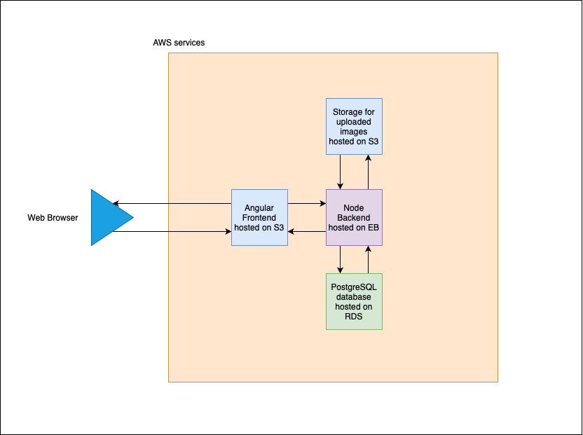

# Udagram

This application is provided to you as an alternative starter project if you do not wish to host your own code done in the previous courses of this nanodegree. The udagram application is a fairly simple application that includes all the major components of a Full-Stack web application.


### Dependencies

```
- Node v16 (LTS) or more recent. While older versions can work it is advisable to keep node to latest LTS version

- npm 6.14.8 (LTS) or more recent, Yarn can work but was not tested for this project

- AWS CLI v2, v1 can work but was not tested for this project

- A RDS database running Postgres.

- A S3 bucket for hosting uploaded pictures.

- A EBS envrionemnt 
```

### Installation

Provision the necessary AWS services needed for running the application:

1- Create an S3 bucket to host the front-end files. 

2- Create an S3 bucket to store the media files.

3- Create an EBS application to host the server.

4- Create a public PostgreSQL RDS database.

5- In `udagram/udagram-api`, rename `.env.local` to `.env` and set these variables accordingly.

6- Add the same variables to CircleCI and EBS configurations.

### Deploy

1- use `npm run deploy` to run both frontend and backend

The project is available at

http://front-end-bucket-udacity.s3-website-us-east-1.amazonaws.com/


See additional documentation in the documentation folder.

## Configuration Screenshots

### Elastic Beanstalk Environment


### Elastic Beanstalk Configurations


### S3 Buckets


### FrontEnd S3 Bucket


### Media S3 Buckets


### PostgreSQL RDS database



### CircleCI Pipeline


### CircleCI Environments variables


Schema



### Architecture




## License

[License](LICENSE.txt)
